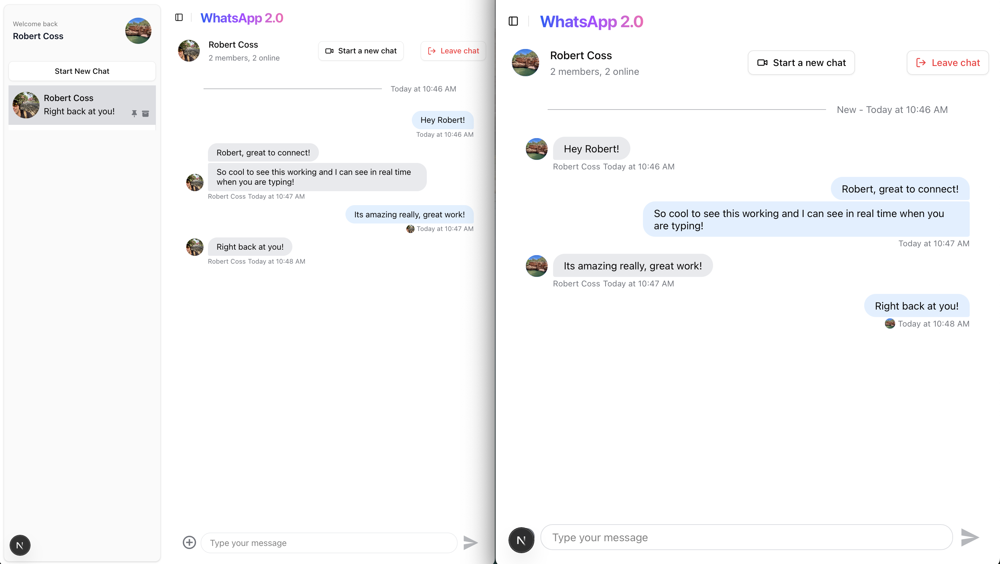
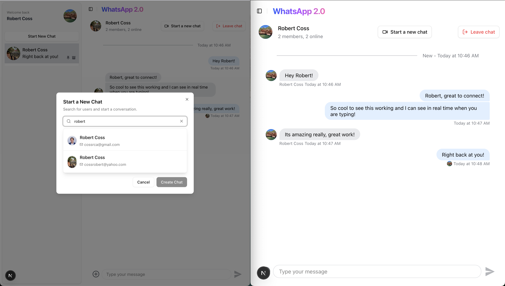

# 💬 Realtime Chat Platform

A **production-grade real-time messaging and video calling app** inspired by WhatsApp. Built with **Next.js 15**, **TypeScript**, **Convex**, and **Stream APIs**, featuring Google OAuth secure authentication, and scalable architecture.

---

## 📸 Demo Screenshots

### 1. Chat Interface

### 2. User Search and Chat Functionality

### 3. Landing Page & Dropdown

### 4. Convex Users Table

---

## 🚀 Quick Start

>**Requirements:**  
> Make sure you have [Node.js](https://nodejs.org/en/) 18+, [pnpm](https://pnpm.io/), and a [Convex](https://www.convex.dev/) account set up.

---

### **How to Run**

Once everything is installed, **you must run two commands in separate terminals** to launch the app:

| Terminal | Command         | Purpose               |
|-----------|----------------|-----------------------|
| **1**     | `npx convex dev` | Runs the Convex backend (real-time database & functions) |
| **2**     | `pnpm run dev`   | Runs the Next.js frontend on `http://localhost:3000` |

> ⚡ **Important:**  
> Keep both terminals running at the same time for the app to function properly.

Happy coding, and enjoy! 🚀 **[Robert Coss](https://linkedin.com/in/robert-coss)**

---

## ✨ Features
- 💬 **Real-time messaging** with typing indicators & read receipts
- 📹 **One-on-one and group video calls** powered by Stream
- 🔐 **Secure user authentication** using Clerk
- 🗂 **Group chat creation & management**
- ⚡ **Fast, scalable backend** with Convex
- 🎨 **Modern, responsive UI** with TailwindCSS

---

## 🌟 Final Notes

This project was built to **showcase my skills as a full-stack developer** and demonstrate how cutting-edge tech stacks can come together to build something both **practical and scalable**.

I wanted to go beyond just another "clone" by integrating:

If you're checking out the repo, take it for a spin — send a few messages, create a group chat, hop on a video call.  
Who knows? You might even find yourself using it like a real app. 😎
