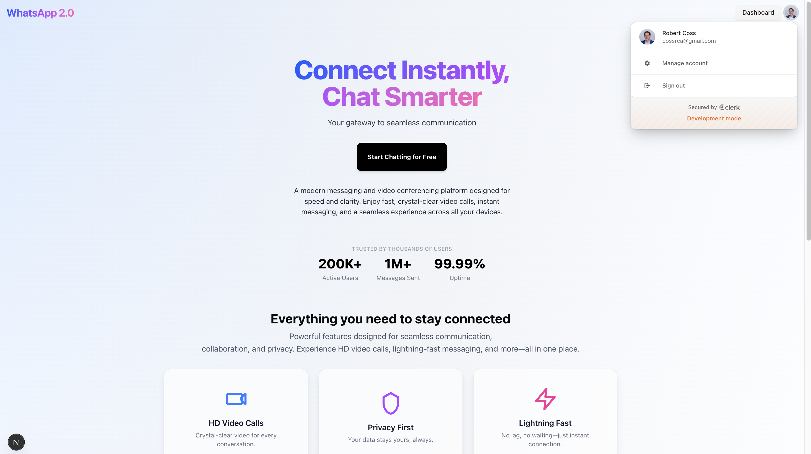
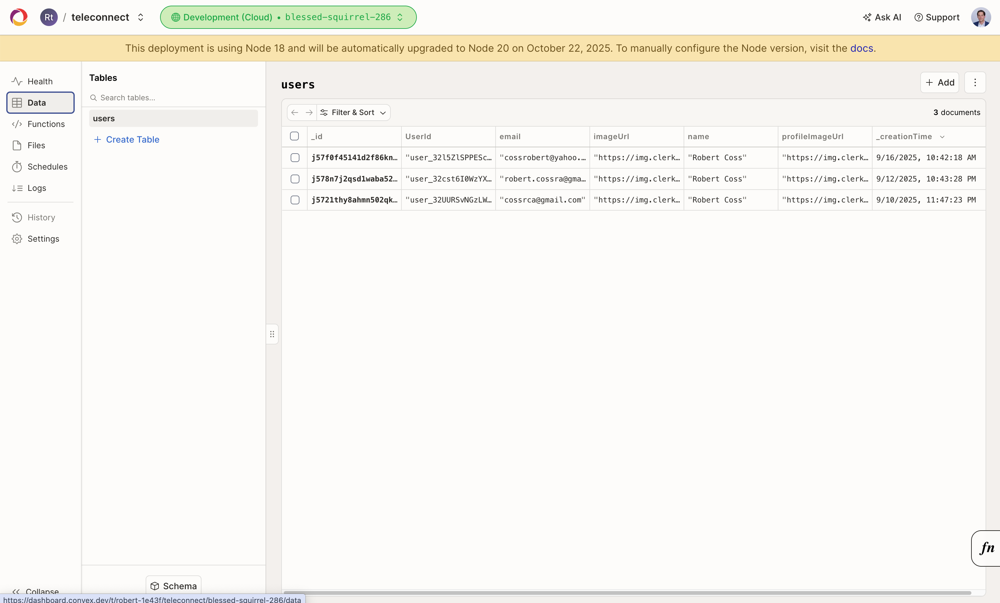

# 💬 Realtime Chat Platform

**Production-ready messaging and video calling application inspired by WhatsApp**

- Real-time chat with typing indicators and read receipts  
- Secure authentication with Google OAuth (Clerk)  
- Group chat creation and management  
- One-on-one video calls powered by Stream  
- Scalable backend built with Convex  
- Modern, responsive UI with TailwindCSS  

---

**AS a user**  
I WANT to send messages and make video calls in real time  
SO THAT I can stay connected seamlessly across devices

---

## 📸 Demo Screenshots

### 1. Chat Interface

### 2. User Search and Chat Functionality

### 3. Landing Page & Dropdown

### 4. Convex Database Admin Dashboard

---

## 🚀 Quick Start

>**Requirements:**  
> Make sure you have [Node.js](https://nodejs.org/en/) 18+, [pnpm](https://pnpm.io/), and a [Convex](https://www.convex.dev/) account set up.

---

### **How to Run**

Once everything is installed, **you must run two commands in separate terminals** to launch the app:

| Terminal | Command         | Purpose               |
|-----------|----------------|-----------------------|
| **1**     | `npx convex dev` | Runs the Convex backend (real-time database & functions) |
| **2**     | `pnpm run dev`   | Runs the Next.js frontend on `http://localhost:3000` |

> ⚡ **Important:**  
> Keep both terminals running at the same time for the app to function properly.

Happy coding, and enjoy! 🚀 **[Robert Coss](https://linkedin.com/in/robert-coss)**

---

If you're checking out the repo, take it for a spin — send a few messages, create a group chat, hop on a video call.  
Who knows? You might even find yourself using it like a real app. 😎

## License
This project is licensed under the [MIT License](./LICENSE).
